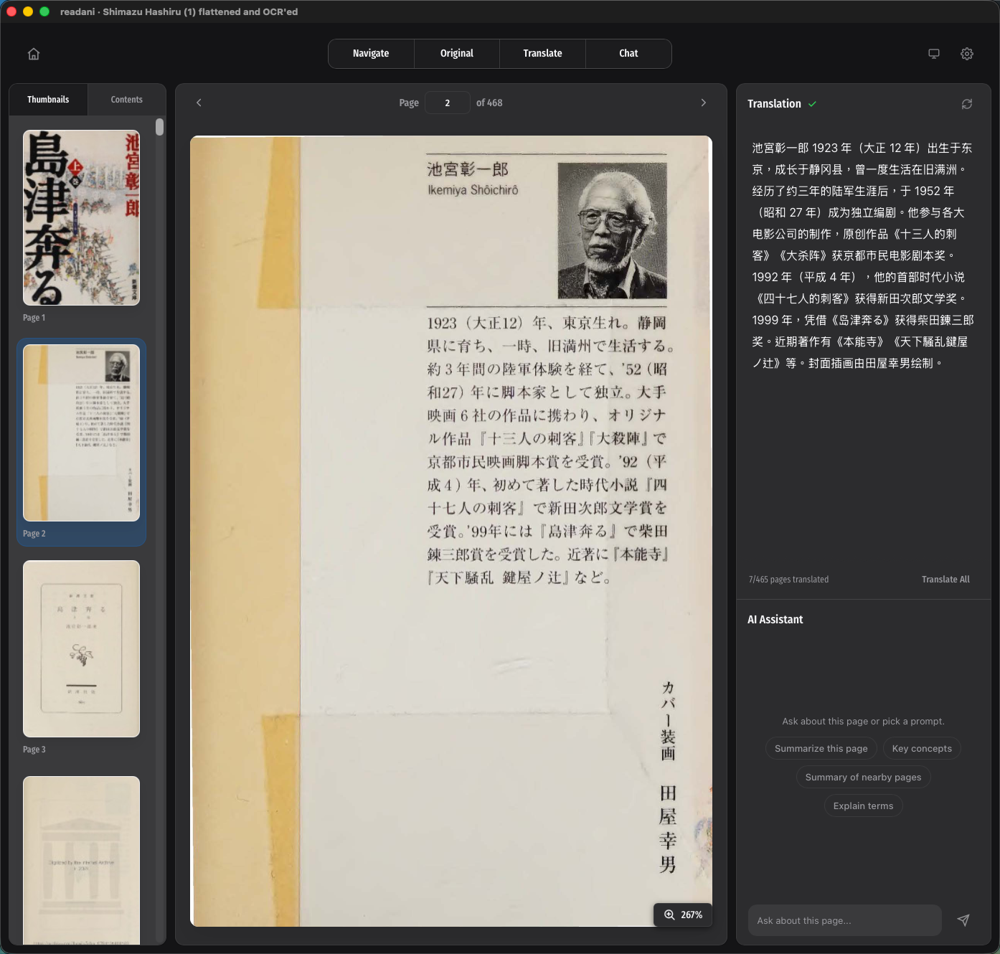

# readani

<p align="center">
  
</p>

<p align="center">
  A desktop bilingual reader for PDFs and EPUBs, built for staying in the text instead of bouncing between tabs.
</p>

<p align="center">
  <strong>v1.1.0</strong> · Tauri · React · TypeScript · pdf.js
</p>

## What It Is

`readani` keeps the original document on the left and the translation on the right, so you can read a foreign-language PDF or EPUB with much less friction. Instead of copying chunks into another tool, you stay inside one focused reading workspace.

It is especially good for research papers, essays, manuals, reports, and other documents where context matters sentence by sentence.

## Why It Exists

Most translation workflows break reading flow:

- you copy text out of the document
- you lose page context
- you jump between windows
- you struggle to match translated text back to the original page

`readani` is built to fix that. It keeps the source document visible, keeps translations nearby, and lets you move around the document without losing your place.

## Highlights

- Side-by-side reading layout for source and translation
- PDF-first reader with preserved EPUB support
- Sentence-aware translation presentation
- Source-page text selection for quick translation lookups
- Local cache for faster re-opens and repeat reads
- English-only desktop UI with light, dark, and system theme modes
- Backend translation requests handled through Tauri/Rust, not from the frontend
- Provider presets for OpenRouter and OpenAI-compatible endpoints

## v1.1.0

This release makes `readani` updater-ready for future versions.

It includes:

- built-in update checks through Tauri's updater plugin
- background download of available updates with a one-click install action
- GitHub release metadata for signed updater artifacts and `latest.json`
- the existing polished home screen, reader shell, and About dialog workflow

## How It Works

### Reader layout

- Left: the original PDF or EPUB
- Right: translations, reading controls, and chat/tools

### Translation flow

- The frontend never calls translation providers directly
- Translation requests go through the Tauri backend
- The backend stores settings and translation cache files under the app config directory
- Cached results can be reused when the same page and translation inputs match

### PDFs

- Uses `pdfjs-dist/legacy/build/pdf.mjs`
- Keeps a selectable text layer when the PDF has usable text
- Handles text-based PDFs and OCR-text PDFs best
- Image-only PDFs without usable text show a fallback instead of pretending the text exists

## Local Development

### Requirements

- [Bun](https://bun.sh/)
- Rust toolchain
- Tauri prerequisites for your platform

### Start the app

```bash
bun install
bun run tauri dev
```

### Build the frontend bundle

```bash
bun run build
```

## Project Structure

- `src/App.tsx` - main app state, routing between home and reader, shared dialogs
- `src/views/HomeView.tsx` - landing view and recent-books entry point
- `src/components/PdfViewer.tsx` - PDF viewing shell
- `src/components/PdfPage.tsx` - PDF page rendering and selection layer
- `src/components/TranslationPane.tsx` - translation presentation
- `src/components/settings/SettingsDialogContent.tsx` - provider and translation settings UI
- `src/lib/textExtraction.ts` - PDF text extraction heuristics
- `src/lib/pageTranslationScheduler.ts` - queued translation flow
- `src-tauri/src/lib.rs` - Tauri commands and translation orchestration
- `src-tauri/src/providers.rs` - provider request shaping
- `src-tauri/src/page_cache.rs` - translation cache handling

## Product Notes

- UI copy is intentionally English-only
- Translation quality depends on the provider, model, and source document quality
- Cache identity depends on the document, source text, selected model, and target language
- API keys stay in the app config area, not in the frontend bundle

## Tech Stack

- Tauri
- Rust
- React 19
- TypeScript
- Radix UI
- pdf.js
- Slate
- react-virtuoso

## Acknowledgements

- Created by Gallant GUO
- Contact: [glt@gallantguo.com](mailto:glt@gallantguo.com)
- Special thanks to [Everett (everettjf)](https://github.com/everettjf), author of [PDFRead](https://github.com/everettjf/PDFRead)

## License Notes

This repository includes bundled font assets with their own license text in [`src/assets/fonts/fira-sans-condensed/OFL.txt`](./src/assets/fonts/fira-sans-condensed/OFL.txt).
